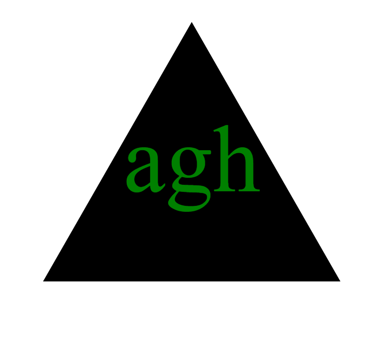

<div align="center">

# Logo Genius

[](https://opensource.org/licenses/MIT)


 
 

</div>

## Desciption 

The Logo Genius is a command-line application designed for freelance web developers who need to quickly generate simple logos for their projects without the need for a graphic designer. The application allows users to input text, choose text and shape colors, and select from a variety of shapes including circle, triangle, and square. The output is an SVG file named logo.svg that can be used as a logo for web projects.

## Table of Contents

- [Description](#description)
- [Installation](#installation)
- [Usage](#usage)
- [Features](#features)
- [Contributing](#contributing)
- [Tests](#tests)
- [License](#license)


## Installation

Before you can run Logo Genius, you need to ensure that Node.js and npm (Node Package Manager) are installed on your system. If you don't already have Node.js and npm installed, you can download and install them from Node.js official website. This installation will include npm by default.

<b>Installing Node.js and npm</b>
1.  Go to https://nodejs.org/.
2.  Download the version appropriate for your system (Windows, Mac, Linux).
3.  Run the installer and follow the prompts to install Node.js and npm.

To verify the installation, open a terminal or command promt and type: 

```bash
node -v
```

```bash
npm -v
```

This will display the version of Node.js and npm installed on your system, confirming that the installation was successful.

```bash
node --version
```

```bash
npm --version
```
<b>Setting Up Logo Genius</b>

After installing Node.js and npm, you can set up Logo Genius:


Clone the repository to your local machine: 
```bash
git clone https://github.com/haartmuhn/logo-genius.git
```

Navigate to the project directory:
```bash
cd logo-genius
```

Install necessary Node.js packages:
```bash
npm install
```

Install Inquirer package:
```bash
npm install inquirer
```

## Usage

To use Logo Genius, run the following command from the root of your project directory:

```bash
node index.js
```

The following video shows the web application's functionality: 

<div align="center">

[logo genius.webm](https://github.com/haartmuhn/logo-genius/assets/164945655/4fb990a5-6c77-4c2b-ae9c-5df7d970ea61)

The following image shows the web appearance:



</div>

## Features

-	Generate simple logos with custom text and shape colors.
-	Choose from a variety of shapes including circle, triangle, and square.
-	Easy-to-use command-line interface with prompts for user input.
-	Output SVG files can be used directly in web projects.

## Contributing

Contributions to Logo Genius are always welcome, whether they involve bug fixes, improvements, or new features. We adhere to the Contributor Covenant code of conduct. Here’s how you can contribute:

1.  Fork the repository on GitHub.
2.  Clone your fork to your local machine.
3.  Create a new branch for your changes.
4.  Make your changes and test them.
5.  Submit a pull request with a clear description of the improvements.

Please ensure your code adheres to the existing style, and include updates to documentation and tests as needed.

## Tests

The Logo Genius includes unit tests for the shape classes using Jest. To run the tests, execute the following command:
```bash
npm test
```

If all the tests pass successfully, Jest will output a summary indicating that all tests have passed.
```bash
PASS  lib/shapes.test.js
  ✓ Circle render method (5 ms)
  ✓ Triangle render method (1 ms)
  ✓ Square render method

Test Suites: 1 passed, 1 total
Tests:       3 passed, 3 total
Snapshots:   0 total
Time:        0.7 s, estimated 1 s
```

## License 

[MIT License](https://opensource.org/licenses/MIT)